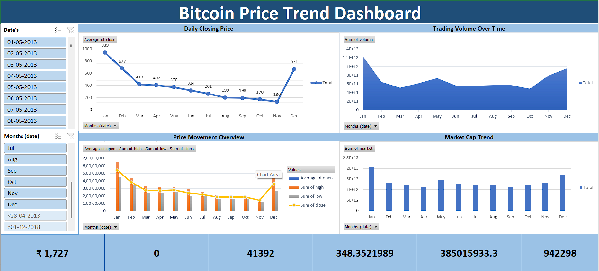

# 🪙 **Bitcoin Market Analysis Dashboard**
### *Interactive Financial Intelligence & Data Visualization*

---

## 📝 **Project Overview**
This project demonstrates the use of **Microsoft Excel** as a powerful Business Intelligence (BI) tool. By transforming raw cryptocurrency transactional data into a dynamic dashboard, this project allows for the tracking of Bitcoin market movements, price volatility, and volume clusters. It is designed to provide actionable insights through automated data pipelines and professional-grade visualizations.

---

## 🛠️ **Core Dashboard Features**
This dashboard utilizes advanced Excel functionality to provide a seamless user experience:

* 📈 **Dynamic Price Trends:** Interactive charts tracking historical price movements and "All-Time High" (ATH) markers.
* 🎛️ **Market Slicers & Timelines:** User-friendly filters to drill down into specific years, quarters, or months instantly.
* 📊 **Volume Analysis:** Comparative views of trading volume versus price action to identify market strength.
* 🧬 **Automated Data Pipeline:** Built using **Power Query** to ensure data can be refreshed and scaled easily.
* 📍 **KPI Metrics:** Dedicated cards for key performance indicators like current price, daily change, and market cap.

---

## 🖥️ **Dashboard Preview**

*Above: High-resolution preview of the interactive Bitcoin Analysis Dashboard.*

---

## ⚙️ **Technical Stack**
* **Software:** Microsoft Excel (Office 365 / 2021)
* **ETL Engine:** Power Query for automated data cleaning and transformation.
* **Analytics:** Pivot Tables, Dynamic Arrays, and Statistical Modeling.
* **Design:** Custom UI/UX layout with conditional formatting and interactive controls.

---

## 🚀 **How to Access the Project**
Due to the file size and interactive elements, the main dashboard is hosted externally:

👉 **[Download Bitcoin Dashboard from Dropbox](https://www.dropbox.com/scl/fi/zxfn5jao86e09kq6ewc14/Bitcoin-Dashboard.zip?rlkey=1uhdmgpq5ig3c0l8yjdfife9d&st=qfmcn51p&dl=0)**

1. Download the `.zip` file from the link above.
2. Extract and open the `.xlsx` workbook.
3. Click **"Enable Content"** to allow the Power Query connections to function.
4. Navigate to the **Data** tab and select **Refresh All** to update the analytics.

---

## 🤝 **Acknowledgments**
* **Author:** Anurag Kokate
* **Mentor:** Yash
* **Institution:** Developed at **Fireblaze Technologies Pvt. Ltd.**
